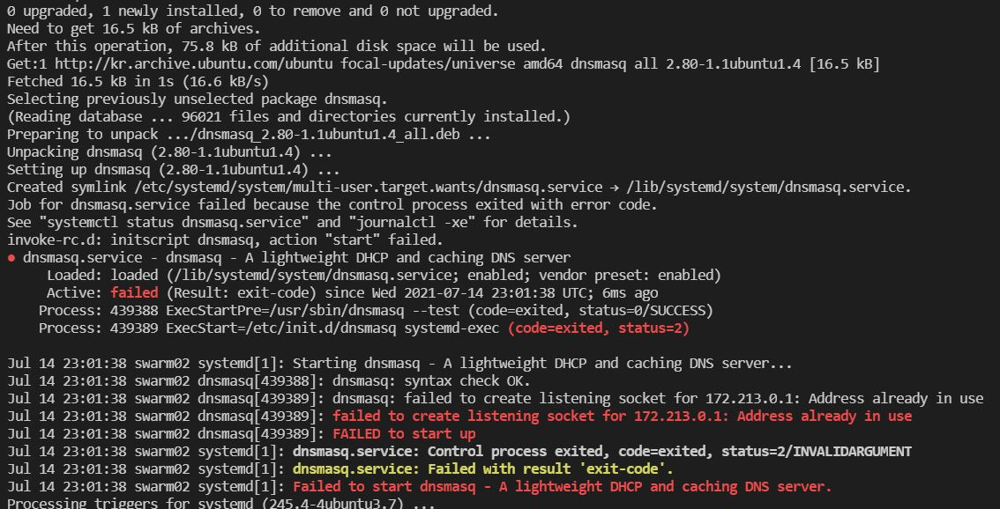

# 목차
* [7월 1주차](#7월-1주차)
* [7월 2주차](#7월-2주차)
* [7월 3주차](#7월-3주차)
* [7월 4주차](#7월-4주차)

<br>

# 7월 1주차
## 2021/07/01
1. 백준 11726번 try 2 (solved&#46;ac class3 essential)  
: 앞서 사용했던 알고리즘의 반례를 찾아내어 알고리즘을 약간 수정했지만, 알고리즘의 근본적인 문제를 발견하지 못하여 문제를 풀어내지 못하였다.  

1. 자기주도연구 및 인턴 준비 면담  
: 2학기부터 진행할 자기주도연구와 연구실 인턴 생활을 준비하기 위하여 교수님과 면담을 진행하였다. 면담을 진행하면서 교수님께서 연구하고 계시는 분야에 대하여 설명을 러프하게 들었고, 궁금했던 클라우드 컴퓨팅에 관하여도 여쭈어보아 지식을 얻을 수 있었다. 이번주부터 연구를 위한 사전 준비를 시작하기로 하였다.  

<br>

## 2021/07/02
1. 백준 11762번 풀이 완료 (solved&#46;ac class3 essential)  
: 순열 식과 나머지의 성질을 이용해서 문제를 풀이할 때의 잘못된 점을 V견하여 해당 풀이를 포기하고 다이나믹 프로그래밍을 활용하여 문제를 해결하였다. 앞서 시도한 방법을 사용하여 문제를 풀이하면 순열 점화식을 이용해 수를 나누는 연산 중에 손실되는 수가 생기고 수가 정수로 유지되지 않게되어 잘못된 풀이가 되는 것이였다.  

<br>

## 2021/07/03
1. 마크업 문서에서 스페이스바로는 공백의 크기를 조절할 수 없는데, html 엔티티 코드를 이용하면 조절할 수 있을 것이라고 생각해 찾아보았는데 해당 코드를 발견하였고 적용이 잘 이루어졌다. 공백을 뜻하는 html entity 코드를 자주 사용하는 코드 표에 추가하였다.

1. 링크를 연결하는 것이 아니라 단순히 사이트를 표기하고자 할 때에도 링크의 형식을 띄면 링크로 간주해버리는 것을 방지하고자 온점을 생략하고 사이트를 표기했었는데, 위와 마찬가지로 온점도 html 엔티티 코드를 사용하면 이런 문제를 해결할 수 있을 것이라 생각해 적용해보니 문제를 해결할 수 있었다. 온점을 뜻하는 html entity 코드 또한 자주 사용하는 코드 표에 추가하였다.

1. 처음 TIL을 진행하면서 모르던 지식들을 찾아보고, 공부하게 되면서 내가 러프하게 생각하고 있던 개념과 달랐던 것들이 종종 있어 공부 방향과 계획에 자잘한 수정이 생기게 되었다. 하여 시작할 때에 비해 진행하고 있는 공부의 종류가 늘어나게 되었는데, 처음에 만든 하나의 저장소에 이들을 모두 업로드 하자니 쓸데없는 반복적인 작업들을 해야되고, 정리도 제대로 되지 않아 난잡한 느낌이 들었다.

    이런 문제를 해결하고자 큰 분류에 따라 저장소를 구분하여 커밋을 하는 것이 좋겠다는 판단이 들었고, 이를 위해 3개의 원격 저장소(기존 TIL 기록 외 코딩테스트준비/리눅스커널프로그래밍/웹페이지제작)를 새로 만들고 로컬 저장소를 분류하여 각각의 원격 저장소에 연결해주었다.  

1.  위에서 설명했듯이 깃허브에 새로운 리포지토리를 만들었는데, 원격 저장소와 로컬 저장소를 연결하는 과정에서 모든 과정을 정상적으로 진행했음에도 불구하고 push를 시도하면
    ```
    error: failed to push some refs to 'github 계정'  
    ```
    이라는 에러가 계속해서 발생하였다.
    원인을 검색해보니 일반적으로 나처럼 리포지토리를 처음 만들 때 발생하기보다는 저장소 동기화가 되어있지 않은 경우에 remote의 버전과 현재 로컬의 버전이 맞지 않아서 conflict가 발생하여 나타나는 에러였다. 이러한 경우에는 pull --rebase로 버전을 맞춰주어 에러를 해결할 수 있다고 한다.

    어쨌든 때문에 무엇이 문제인지 찾는데 상당히 오랜 시간이 걸렸는데, 로컬 저장소에서 원격 저장소에 push 할 파일이 없는 경우에 이러한 에러가 나타날 수 있다는 내용을 찾아냈다. 앞서 일어났던 에러와 상황들을 생각했을때 이 문제 때문이 맞는듯 생각되었는데, 내 로컬 저장소에는 파일이 존재하는데도 불구하고 bash에서는 add를 시도하거나 status를 확인할 때에 계속 아무 파일이 없는 듯이 동작하고 있었기 때문이다.

    대체 왜 파일을 인식하지 못하는걸까 하다가 ignore 파일을 열어보았는데, 오타를 내었던 건지 모든 파일을 무시하라는 신호인 *라는 텍스트가 떡하니 적혀있는걸 발견했고..... 충격과 공포에 휩싸여 지우고 다시 시도했더니 잘 동작되더라는.. 그래도 해피 엔딩일까..?ㅎ..  
    어찌 되었든 문제를 잘 해결한 후에 이에 대한 내용을 error solution에 정리해주었다.  

1. 리눅스 커널 프로그래밍을 공부하기 위해서는 리눅스 머신이 필요한데, 윈도우 10을 사용하고 있는 내 노트북을 갈아엎기는 싫어서 가상머신을 설치하고 그 위에 리눅스(우분투)를 올리고 그 위에 KVM/QEMU를 올려 환경을 구축하기로 결정했다. 이 외에도 WSL(Windows Subsystem for Linux)를 이용하여 KVM/QEMU를 설치할 수 있다고 하는데, 가상머신 VMware를 돌리는 것보다 정보도 적고 환경을 구축하기도 힘들 것 같아 이 방법은 사용하지 않았다.

    사용할 수 있는 대표적인 가상머신으로는 VirtualBox와 VMware가 있었는데, VMware의 평가가 전체적으로 더 좋았기에 VMware를 선택하여 설치하였다. VMware를 설치하고 그 위에 우분투를 설치하여 실습을 위한 환경을 구축하였다.

1. 설치한 우분투에 리눅스 커널과 KVM/QEMU를 설치하고자 하였으나, 설치 순서를 잘못 이해하여 설치를 완료하지 못하였다.

<br>

# 7월 2주차
## 2021/07/04
1. 백준 11399번 풀이 완료 (solved&#46;ac class3 essential)  
: 일전에 알고리즘 수업에서 공부했던 greedy 알고리즘으로 푸는 문제여서 vector를 sort한 뒤 해당 알고리즘을 사용하여 문제를 해결했다.

1. 설치한 가상머신 우분투에 QEMU를 이용한 가상 시스템을 구축하였다. 또한 실습에서 사용할 스크립트와 스켈레톤 코드를 깃을 통해 받아와 컴퓨터에 빌드하였다. 

<br>

## 2021/07/05
1. 백준 1927번 풀이 완료 (solved&#46;ac class3 essential)  

1. VMware를 이용한 방법이 너무 느린 듯해서 윈도우에서 지원하는 WSL을 이용해 가상환경 구축을 시도했다. 스토어에서 우분투(20.04)를 다운받아 윈도우 폴더를 우분투의 폴더에 마운트 시도하였으나 계정 문제(에러 코드 13)로 계속해서 에러가 발생하였다.

<br>

## 2021/07/06
1. 5일에 하던 작업을 이어서 계속하였다. 처음에 계정을 ubuntu-ss로 설정하였다가 특수문자가 들어가면 안된다는 글을 보고 계정의 이름을 ubuntu로 변경해서 작업을 진행했었는데, 시스템 내부적으로 설정되어 있는 계정의 이름으 ubuntu-ss로 계속해서 유지가 되어서 계속해서 로그인 실패 에러가 발생했던 것으로 추정된다. 계정을 아예 새로 만들고 그 계정으로 로그인을 시도하니 별 다른 옵션을 조작하지 않고도 폴더가 정상적으로 마운트되었다.

1. 폴더가 마운트 되었지만 마운트된 폴더 내에 존재하는 폴더(디렉토리)에 접근하면 해당 폴더의 내용을 읽을 수 없는 현상이 발생하였다.

    ```
    ex) 공유 폴더 : a & a 내부에 폴더 b 일때,
        a 내부의 파일 모두 접근 가능
        b 폴더 접근 가능
        b 내부의 파일, 폴더 모두 접근 불가능 (리스트 읽기[ls]도 불가능)
    ```
    하여 해당 현상을 해결하기 위해 많은 검색을 해보았으나, 폴더를 모두 따로 마운트 하는 방법 밖에는 없는 듯 보였다. 공유 폴더에서는 딱 그 폴더 내부에 존재하는 내용만 공유가 가능하다고 한다.  

    qemu를 빌드하려면 수천개의 폴더가 있는 디렉토리를 사용해야 했기에 모든 폴더를 직접 마운트 하는 것은 불가능 하였다. (파이썬 코드를 짠다거나 해서 굳이 하자면 할 수야 있겠다만 해야하는 작업에 비해 너무 큰 노력이 들어간다.) 하여 계속해서 다른 방법을 강구하여 보았는데, 검색을 처음에 너무 조금 한 건지.. 윈도우용 우분투에서는 /mnt라는 폴더를 이용해서 윈도우의 디렉토리에 접근할 수 있다는 내용을 찾아 확인해보니 이 경로로 모든 폴더에 쉽게 접근할 수 있었다.

1. 폴더를 마운트 한 후에 git으로 리포지토리를 클론해오는데 계속 오류가 발생해서 일단 zip으로 다운받아서 이용하기로 했다. 그런데 zip을 다운받아서 압축을 푸는 중에 aux.c aux.h 파일 두 개가 존재하지 않는다?라고 나오고 13개 파일이 중복된다고 나오길래 일단 넘어가기는 했는데 이상해서 확인해보니, 윈도우에서는 aux라는 이름을 가진 폴더와 파일은 만들 수 없어서(이외 con, prn 등도..) 파일이 존재하지 않는다고 나오는 것이였다.  

    그리고 13개 파일이 중복이라고 나오는건 깃으로 클론을 시도했을 때 나왔던 오류 메세지를 살펴보니 같은 단어인데 대/소문자가 다른 파일/폴더에 대해서 윈도우에서는 대/소문자를 구분하지 않고 같은 파일/폴더로 인식하고 있어서 생긴 오류였다.  

    때문에 위의 두 가지에 대해서 해결법을 찾아보았는데, 먼저 만들 수 없는 파일명의 파일을 만드는 문제는 검색을 해도 제대로 된 방법이 나오지 않아서 조금 고생을 했다. 그나마 비슷한 문제에 대해서 해결한 사람이 글을 올려주신게 있었는데, aux 등의 만들 수 없는 이름을 가진 폴더를 만들고자 할 때에 윈도우 cmd 창에서 md 명령어와 \\.\ 그리고 폴더를 만들 디렉토리의 절대경로\(만들 수 없는 폴더 이름)을 명령해준 후에, 해당 디렉터리를 새로고침하면 폴더가 만들어진다는 내용이였다. 예를들면 명령 프롬포트에 ```md \\.\C:\aaa\bb\c\aux```라는 명령을 내리면 c라는 디렉터리에 aux가 생기는 것이다. 이 내용을 보고 혹시 폴더 말고 파일을 만드는 법은 없는지 검색해보았지만 찾을 수 없었기에, 다른 방법을 강구해야했다.  

    해결 방법은 명령 프롬포트에서 파일을 만드는 법이 없나 생각하다가 찾게 되었는데, 윈도우에서는 파일을 편집하는 기능이 (내가 알기론) 텍스트 파일을 만드는 정도 밖에 없지만 리눅스에서는 vim이나 nano 등을 이용해 cpp 파일을 편집하거나 만들었던 기억이 뇌리를 스쳤다. 마침 우분투도 깔았고 리눅스 운영체제에서는 aux를 파일명으로 하는 것이 제한되지 않으니 우분투의 쉘에서 이 파일을 만들 수 있지 않을까?라는 생각이 들었고, aux.c와 aux.h 파일의 내용을 직접 찾아서 복사해야하는 수고가 있긴 했지만 우분투의 vim으로 aux.c와 aux.h 파일을 만들고 소스코드 내용을 붙여넣는 것으로 문제를 해결할 수 있었다.

    다음 문제인 대/소문자 구분은 해결법을 비교적 찾기 쉬웠는데 윈도우에서 개발자들을 위해 지원하고 있는 파워쉘(PowerShell)의 명령어를 사용하여 대/소문자 구분이 가능하도록 설정을 변경시켜줄 수 있다고 한다. 명령어는 다음과 같다
    ```
     file setCaseSensitiveInfo (폴더 절대경로) enable
     ```
     문제는 이렇게 설정 변경을 해도 딱 해당 폴더에만 적용이 되고 하위 디렉토리에는 적용이 안된다는... 쉽지 않은 문제가 있어서 노가다를 좀 해주긴 해야한다.. 반복을 많이 하진 않지만 나중에도 이런 작업 계속 해야될 것 같은데 이럴거면 그냥 상위 디렉토리 이름만 입력하면 그 하위 디렉토리까지 모두 설정 변경해주는 프로그램을 어떻게 잘 만들어볼까 싶을 정도로.. 이걸 왜 하고 있나 싶었다. 진로를 이쪽으로 나갈 줄 알았으면 윈도우 사지 말걸 그랬다며 후회 백만번 하면서 열심히 노가다 뛰어서 완성했다.

     이 다음에 문서 파일 빌드할 때도 Document 폴더 내부에 있는 하위 디렉토리들에서 이 작업들 해야하는게 있어서 걍 싸그리 긁어다가 반복 작업 할때는 진짜 싼 조립식 노트북이나 데탑 하나 맞출까 진지하게 고민 ㅎㅎㅎ... 물론 이 다음에도 오류가 한가득이었기 때문에 지금도 진지하게 고민중..

1. docker-compose 작동 불가 오류 해결 : 어찌저찌 파일들 다운까지 완벽히 받고 이제 드디어 문서를 빌드했는데 이번엔 망할 docker가 오류를 냈다. 오류 내용은 ```docker: unrecognized service``` 이고, 이 문제는 아직 리눅스 명령어를 제대로 몰라서 어떻게 해결 된 건지는 모르겠지만 어떤 분이 올려주신 글을 따라했더니 해결되었다. [해당 글로 이동하기](https://www.codegrepper.com/code-examples/shell/docker%3A+unrecognized+service "바로가기")

1. 위의 에러를 해결하고 docker를 작동 시켜 문서 빌드를 시도했지만 당연하게도 또 에러가 났다...ㅎ 총 세 가지의 문제로 다음과 같다.  

    1. ```update-alternatives: warning: not replacing /usr/bin/pip with a link```   

        도커 파일 실행 중 아래 코드에서 나타난 에러이다.
        ```docker
        RUN update-alternatives --install /usr/bin/pip pip /usr/bin/pip3 1
        ```
        이 에러 관련해서는 아무리 찾아봐도 잘 이해가 안되고.. ~~다음 코드를 사용하면 문제가 해결된다고하여 적용시켰더니 해결되었다. 해당 글에 따르면 어떠한 문제 발생할 수도 있다고 하니 조심하자.~~  
        -> 다른 환경에서 이 코드를 다시 사용했더니 문제가 해결되지 않았다. 이에 대한 내용을 재차 기술하였다. [바로가기](#20210709 "21/07/09")
        ```docker
        RUN yes '' | update-alternatives --force --all
        ```

    1. ```sphinx-rtd-theme 0.5.2 has requirement docutils<0.17. but you'll have docutils 0.17.1 which is incompatible.```

        sphnix_rtd_theme에서 docutils의 버전을 0.17 이하로 제한한다는 에러가 발생하였다. 에러를 발생시킨 코드는 아래와 같다.
        ```docker
        RUN pip install Sphinx==1.6.7 sphinx_rtd_theme hieroglyph==1.0
        ```        
        도커파일에선 최신 패키지로 작업을 하도록 되어있기 때문에 현 시점(21/07/07)에서 최신 버전이 0.17 이상이었기 때문에 도커파일에 다음의 코드를 위에 나온 코드 위에 추가해주어 docutils 패키지의 버전을 다운그레이드 해주었다.
        ```docker
        RUN pip install 'docutils<0.17' --force-reinstall
        ```

    1. 마지막 에러는 위에서도 언급했던 폴더/파일명 대/소문자 구별이 불가능해서 생긴 에러로 모든 폴더에 대해 대/소문자 구분이 가능하도록 세팅해주어 문제를 해결하였다.

1. 위의 오류들을 모두 해결하고 make boot로 처음으로 qemu를 부팅시킬 수 있게 되었다. 그런데 첫 부팅 시간이 이렇게 오래 걸렸었나? 싶을 정도로 아주 심각하게 오래 걸려서 VMware를 계속 사용해야 하는지에 대한 고민이 들었다. 문제는 부팅이 정상적으로 완료되었으면 두 시스템을 비교해서 한 가지를 결정하려고 했는데 또 오류가 났다는 것...
    ```
    qemu/create_net.sh tap0
    dnsmasq: failed to create listening socket for 172.213.0.1: Address already in use
    qemu/create_net.sh tap1
    dnsmasq: failed to create listening socket for 127.0.0.1: Address already in use
    ```
    이런 에러가 발생하여 부팅이 되지 않았는데 이 문제가 왜 일어나는지 아직 알아내지 못해서 (대충 서버 관련한 문제인건 알겠지만..) 아직 제대로 부팅을 해보지 못했다.  
    
    내일까지는 모듈을 올려서 보고서를 제출해야하니 일단 VMware에서 모듈을 올리는 실습을 하여 보고서를 작성해야겠다..

    
<br>

## 2021/07/07
1. The Linux Kernel에서 제공하는 Introduction을 따라가며 공부 및 실습하였다. Source code navigation과 Kernel Debugging에 사용되는 툴들에 대한 내용을 알아보고, 일전에 부팅한 VM에 virtual disk를 추가하는 방법, GDB를 연결하는 방법에 대하여 실습하였다. virtual disk는 성공적으로 마운트 했지만, GDB를 연결하는 과정에서 계속해서 등록한 중단점이 제대로 작동하지 않았다. 이후에 사용 환경을 변경하여 실습을 진행할 예정인데 이 부분을 유의해서 다시 실습해보아야겠다.

1. 설치한 qemu 기반 VM을 실행하는 방법을 간단히 정리한 md 파일을 작성하였다.  

<br>

## 2021/07/09
1. 백준 11279번 풀이 완료 (solved&#46;ac class3 essential)  
: 최대힙을 구현하는 문제로 바로 전에 최소힙을 구현하는 문제를 해결하였기 때문에 이 코드에서 숫자를 비교하는 부분의 코드만 수정하여 문제를 해결하였다.

1. 연구실에서 제공해준 원격 리눅스 서버에 SSH로 접속하여 환경을 새로 세팅하였다. The Linux Kerenl에서 제공하는 Document 파일 빌드를 가장 먼저 시도하였는데, 빌드 중 오류가 발생하여 이를 해결하였다. 발생한 오류는 총 세 가지인데, 두 가지는 앞서 발생했던 오류와 같았다. 하지만 그 중   ```update-alternatives: warning: not replacing /usr/bin/pip with a link``` 오류는 같은 해결 방법으로 해결이 되지 않아 다른 여러가지 방법으로 해결을 시도해보았다.

    1.  ```update-alternatives: warning: not replacing /usr/bin/pip with a link```  
    나중에 알게 된 사실이지만 error가 아니라 결과에 큰 문제가 발생하지 않았다면 warning이여서 꼭 고칠 필요가 없는 사항이였다. 이 에러를 발생시키는 코드인 ```Run update-alternatives --install /usr/bin/pip pip /usr/bin/pip3 1```를 삭제하고 파일을 빌드시켜보았는데 문제없이 정상적으로 동작하였다. 문제의 정확한 원인은 파악하지 못했지만 python과 pip의 버전 관련한 문제로 추정되는데, 이전 글들 중에 pip이 업그레이드를 하면 에러가 발생하는 경우가 많고, 설치가 제대로 안되며 “no search file or directory” 에러를 발생시킨다는 글이 많았다. 이러한 오류를 해결하기 전에 작성된 Docker 파일이라서 수정 후에 배포된 pip에서는 필요하지 않은 코드가 들어있었던건 아닌가 추측하고 있다. (아직 리눅스에 대해 거의 아는게 없는 꼬꼬마의 추측일 뿐이지만...)  
    pip과 pip3 모두 같은 곳으로 연결이 되어 있었는데(때문에 pip과 pip3를 실행시켰을 때 같은 파일이 실행되는 듯 했다. 버전을 확인했을 때도 완벽히 같은 버전이였는데 어떤 버전이였는지는 잘 기억이 안나는..), 이것이 자동으로 설정되어있는? 그런 형태 같았고, 때문에 처음에는 /usr/bin/pip을 삭제하는 코드를 삽입해주어서 warning을 제거할 수 있었다. 그런데도 코드가 돌아가지 않아서 이 문제때문에 빌드가 안되는 것이 아니라는걸 알았고, 현재 환경에서는 굳이 필요없는 코드라는 것도 알게 되었다.

    1. ```ruby
        make[1]: Entering directory '/linux'
        mkdir: cannot create directory '.tmp_55': Permission denied
        mkdir: cannot create directory '.tmp_57': Permission denied 
        
        ...
        
        mkdir: cannot create directory '/linux/Documentation/output': Permission denied
        ```
        디렉토리의 권한 설정에 대한 문제로 인해 위와 같은 오류가 발생하였다. 두 폴더(linux/, linux/Documentation/) 모두 사용자(u)와 그룹(g)에 대해선 rwx로 모든 권한이 주어져 있었지만 다른 사용자(o)에 대하여 r-x 권한으로 쓰기 권한이 주어지지 않게 설정되어 있었다. Dockerfile로 실행하게 되면 sudo로 실행 권한을 주더라도 다른 사용자로 인식이 되는 모양이다. 두 폴더에 다음과 같은 코드로 다른 사용자의 쓰기 권한을 추가해주어 error를 해결하였다.  
        ```
        ~$ chmod o+w linux/
        ~$ chmod o+w linux/Documentation/
        (or ~/linux$ chmod o+w Documentation/)
        ```

1. 원격 서버 html 파일 열기 : Simple web server - python3

    앞선 과정을 통해 빌드한 Document 파일은 html 형식으로 이루어져 있는데, 로컬에서는 그냥 웹브라우저에서 바로 접근이 가능 하지만 원격 서버에 저장되어 있는 현재는 바로 접근할 수 없다. 따라서 빌드된 html 파일을 확인하기 위해서는 remote server에 존재하는 html 파일을 가져올 수 있는 환경을 만들어주어야 한다.

    다행히 이러한 테스트를 쉽게 할 수 있도록 해주는 파이썬의 http.server(pyhon3) 모듈이 존재하여서 이 모듈을 사용하면 손쉽게 테스트 서버를 열어 서버의 html 파일을 확인할 수 있다.
    ```
    cd (열고싶은 파일이 존재하는 디렉터리)
    python -m http.server (port number)
    python -m SimpleHTTPServer (port number)
    
    ex) python -m http.server 8000
    ```
    위와 같은 명령어를 실행시킨 뒤, 로컬의 웹브라우저에서 아래와 같은 주소를 입력하면 html 파일에 접속할 수 있다.
    ```
    (remote server 주소):(port number)

    ex) xxx.xxx.xxx.xxx:8000
    ```
    터미널에서 Ctrl + C 를 입력하면 파이썬이 종료되어 테스트 서버도 종료된다.


<br>

# 7월 3주차
## 2021/07/10
1. 백준 2630번 풀이 완료 (solved&#46;ac class3 essential)  
: 분할 정복과 재귀함수를 이용하여 문제를 해결하였다.

<br>

## 2021/07/11
1. 백준 1931번 풀이 완료 (solved&#46;ac class3 essential)  
: sorting 함수와 greedy 알고리즘을 이용하여 문제를 해결하였다. 처음에는 start 시간을 기준으로 sorting 한 뒤에 조건 비교를 통해 적합성을 판단하여 문제를 해결하였다. 그 후에 다른 사람들의 풀이를 보고 start 시간이 아니라 end 시간을 기준으로 sorting을 하면 조건 비교를 덜 할 수 있어 더 효율적인 코드를 작성할 수 있다는 것을 알게되어, 해당 방법으로도 문제를 해결해보았다.

1. 원격 리눅스 서버에 가상머신 부팅 완료  
    1. 자동 부팅 시에 KVM을 사용하도록 설정하는 법을 알아냈다. ENABLE_KVM 옵션을 true로 설정해주면 자동 부팅 시에 -enalbe-kvm 옵션을 추가해 부팅하여 kvm을 사용한다.
    1. 원격 서버로 접속해서 가상머신을 부팅하게 되니 이미지를 로드해 QEMU 콘솔을 실행하는 기능이 제대로 기능하지 않았다.
        ```
        Unable to init server: Could not connect: Connection refused
        ...
        gtk initialization failed
        rm: cannot remove 'serial.pts': No such file or directory
        make: *** [qemu/Makefile:36: boot] Error 1
        ```
    위와 같은 error가 발생하면서 부팅이 제대로 되지 않는데, 가상머신이 정확히 어떻게 부팅되는지 모르니 문제를 어떻게 해결 해야할 지 전혀 감이 잡히지 않았다.  
    대충 검색을 해보니 서버이기 때문에 그래픽을 지원하지 않기에 생기는 문제로 추정되는데, 이걸 해결하기엔 아직 내 지식이 부족해서 일단 cmd 창에서 가상머신을 연결하는 방법을 이용해 가상머신을 이용하려고 한다.

1. 학습한 내용(VM 설치 및 부팅)에 대해 교수님께 제출드릴 보고서를 작성했다.

<br>

## 2021/07/12
1. 백준 7576번 풀이 완료 (solved&#46;ac class3 essential)  

<br>

## 2021/07/13
1. 백준 11724번 풀이 완료 (solved&#46;ac class3 essential)  
: 주어진 그래프에서 연결요소를 구하는 문제를 인접 행렬과 dfs, 인접 리스트와 dfs, list와 unordered_set을 사용한 노드 그룹화 세 가지의 방법으로 해결해보았다. 세 가지의 방법 중 인접 행렬과 dfs를 이용한 방법이 가장 빠르게 동작하였고, 노드 그룹화를 이용한 방법이 가장 적은 메모리를 사용하였다. 하지만 인접 행렬을 이용한 방법의 경우에는 사용할 수 있는 노드의 수가 제한적이기 때문에 모든 문제에 대한 solution이 될 수 없다. 노드의 그룹화를 더 빠르게 할 수 있는 solution을 생각해보아야겠다.

<br>

## 2021/07/14
1. git에 The linux kernel에서 제공하는 labs를 업로드하여 관리하고자 하였는데, 잘 작동할 것이라 생각했던 .gitignore을 사용하면 기존 프로젝트를 fork한 것을 알릴 수 없고 원격 저장소에 다른 파일들을 남겨두고 특정 파일(이후 lab에서 작성할 /skels의 코드)만 tracking 할 수가 없어서, submodule을 학습하고 이를 사용해 문제를 해결하였다. 가장 상위 프로젝트에 fork한 프로젝트를 submodule로 추가하고, fork한 프로젝트 내부에서 변경사항을  tracking 하고자 하는 부분(/skels)에 대해 새로운 리포지토리를 생성하여 이를 서브모듈로 추가하는 방법을 사용하였다.

<br>

## 2021/07/15
1. 리눅스 커널에 대하여 이해하기 위하여 리눅스 커널 심층분석 책의 1장과 2장 일부에 대하여 학습하였다. 1장을 통해 리눅스 커널의 역사와 발전 과정, 개략적인 구조 등을, 2장의 앞부분을 통해 커널 소스와 이를 빌드하는 방법 등을 공부하였다.

1. 리눅스 서버에서 VM 부팅 시 잘 부팅은 되지만 dnsmasq 에러가 계속해서 발생하여(이전에 VMware에 올린 우분투에서 시도했을 때도 마찬가지였다) 이 에러를 해결하기 위하여 dnsmasq에 대하여 알아보았다. 하지만 어떤 이유에서 에러가 발생하는지 정확히 알아내지 못하여(아마도 bind9와의 충돌이 원인이지 않을까 생각하고 있기는 하지만..) 에러를 해결하지 못하였다. dnsmasq가 설치되지 않아서 문제가 일어나는 것일까 하여 dnsmasq 설치를 시도해보았는데 다음과 같은 에러가 발생하며 실행에 실패하였다.

    
    
    Lab0인 intruduction과 커널 모듈 추가를 시도해본 후에 제대로 작동하지 않는다면 교수님께 해당 사항에 대하여 여쭙는 메일을 보내고, 작동한다면 보고서에 기록하고 정기 미팅시간에 이에 대한 내용을 여쭐 예정이다.

1. 리눅스 커널의 소스코드 분석에 사용되는 tool인 ctags와 cscope에 대하여 알아보고 정리하였다.

<br>

## 2021/07/16
1. SCPC 예선 준비  
: 오늘 3시에 있는 SCPC 예선을 위해 비주얼 스튜디오로 대회를 위한 환경을 세팅했다. 대회가 치뤄지는 codeground 사용법을 익히고, 시간 단축을 위한 팁과 대회에 나오는 문제 수준에 대하여 알아보았다.

1. SCPC 6차 예선 1번 다이어트 풀이 완료  
: 대회를 위해 가볍게 연습할 겸 코드그라운드 사용도 해보기 위해 풀어보았다. solved ac 기준 실버1 정도의 문제라 풀이하는데 30분도 걸리지 않았다.

1. SCPC 7차 예선 참가 (PM 3:00 ~)  
: 1번과 2번을 빠르게 풀고, 3번 문제를 풀었는데 일부 테스트 케이스 그룹은 통과했지만 마지막 테스트 케이스 그룹에서 어떤 부분에서 틀린지 알 수 없이 계속 틀려서 다음 문제로 넘어갔다.

<br>

## 2021/07/17
1. SCPC 7차 예선 참가 (~ PM 3:00)  
: 전날 밤 쯔음인지 이날 새벽 쯔음인지에 3번 문제 마지막 테스트 케이스 그룹 통과를 보류하고 4번 문제를 풀기 시작했다. 4번 문제까지는 제 정신인 상태에서 풀어서 어떻게 무난하게 예외 케이스까지 찾아서 문제를 잘 풀어냈는데, 5번 문제 풀 쯔음에는 정신이 이미 안드로메다로 날라간 후라서 제대로 풀지도 못하겠는데 제일 어려운 문제기도 해서 문제를 제대로 풀어내지 못했다.. 3번 문제도 다시 보지 못했고... 준비를 좀 제대로 했으면 어디쯤까지는 확실히 풀 수있다고 가정하고 어려운 문제부터 풀어야 되는데 그냥 평소에 백준 푸는 것 말고는 이 준비를 해본적이 없어서 3문제 정도나 풀겠지 싶은 생각에 앞에서부터 차례대로 푼게 약간 미스인듯... 2차 예선(아마 붙..겠지?ㅋㅋㅋ) 때는 일주일 전 정도부터는 준비를 해봐서 좀 더 제대로 대회에 임해봐야겠다.

<br>

# 4주차
## 2021/07/18
1. 백준 18870번 풀이 완료 (solved&#46;ac class3 essential)  
: unordered map과 algorithm 헤더의 sort 기능을 활용하여 15분만에 풀 수 있었다. SCPC라는 제한 시간 내에 최고의 성과를 내야하는 그런 대회를 한 번 경험해보고 나니까 실력이 확 늘지 않았나 싶은 느낌. 생각을 좀 더 밀도있게 하는 능력이 길러진 것 같다.

## 2021/07/19
1. 백준 18870번 풀이 최적화 (solved&#46;ac class3 essential)  
: unordered map 부분을 문제에 알맞게 직접 구현하여 프로그램 수행 시간을 단축해보았다. 뿐만 아니라 Fast IO와 코드 작성 시 수행시간을 단축할 수 있는 방법을 공부하고, 이를 적용해서 처음의 풀이보다 1/5의 시간밖에 걸리지 않는 프로그램을 작성할 수 있었다.


<br>

## 2021/07/21
1. 백준 7662번 풀이 진행 (solved&#46;ac class3 essential)  
: 백준 7662번 이중 우선순위 큐(DEPQ) 문제의 풀이를 위하여 새로운 자료구조인 대칭 최소-최대 히프(SMMH, symmetric min-max heap)에 대하여 공부하였다. 공부한 자료구조를 바탕으로 이중 우선순위 큐의 일부(insert & 최소값 delete)를 구현하였다.

<br>

## 2021/07/22
1. 백준 7662번 풀이 완료 (solved&#46;ac class3 essential)  
: 전날에 이어서 7662번의 남은 부분(최대값 delete)을 구현하였다. 

1. 백준 7662번 풀이 최적화 (solved&#46;ac class3 essential)  
: 18870번과 마찬가지로 Fast IO 코드를 통해 수행시간을 단축하고자 하였는데, 사용하던 [jinhan814님의 Fast IO 코드](https://www.acmicpc.net/blog/view/105 "바로가기")에 약간의 결함이 있어 96%에서 계속 틀렸습니다를 받았다. 논리적 오류가 있는 곳을 찾아 해당 부분을 보완한 코드를 사용하여 프로그램의 수행시간을 1/3 가량 단축할 수 있었다.

<br>
